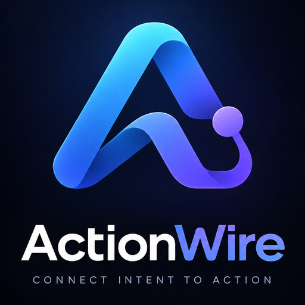

<p align="center">
  
</p>

# Action Wire

A text assistant widget that uses the WebMCP tools already registered on a page. The application owns tool schemas and handlers. The assistant discovers them. Do not define the same tools again in the agent.

Voice is out of scope. The assistant does not persist conversation history across sessions.

## Requirements

- Node.js 22.12+ in the 22 release line, Node.js 24, or Node.js 26+.
- pnpm 12.4.1 for this repository.
- A secure browser context with native `document.modelContext`. See [compatibility](docs/3.project/3.compatibility.md).

## Install

```sh
npm install action-wire
```

One package holds the widget, the headless bridge, the WebMCP source, the model adapter, and the types. Its only runtime dependency is `ajv`.

## Quick start

See the [quickstart](docs/1.guide/04.quickstart.md).

```ts
import { createAssistant, openAICompatible } from 'action-wire';

const assistant = createAssistant({
  model: openAICompatible({ endpoint: '/api/assistant' }),
});
assistant.mount();
```

Register tools on the page with native WebMCP before discovery. Keep model credentials on a Node.js endpoint. Do not put API keys in browser code.

## Exports

`createAssistant` mounts the widget. `createAgentBridge` is the same runtime with no interface. `createWebMCPSource` reads the tools on the page. `openAICompatible` talks to your model endpoint. `AgentError` carries every failure code.

Inside `packages/action-wire/src` the code keeps four layers: `core`, `webmcp`, `agent`, and `widget`. They import in one direction only, and a lint rule enforces it.

## Examples

- `examples/vanilla`
- `examples/react`
- `examples/vue`
- `examples/svelte`
- `playground`: project dashboard used by the journey test.

## Documentation

The full site is in [`docs/`](docs). Run it with `cd docs && pnpm install && pnpm dev`.

- [Introduction](docs/1.guide/01.index.md): what this is and who it helps.
- [Browser setup](docs/1.guide/03.browser-setup.md): the Chrome flag, on every system.
- [Quickstart](docs/1.guide/04.quickstart.md)
- [Without native WebMCP](docs/1.guide/07.without-webmcp.md)
- [Troubleshooting](docs/1.guide/10.troubleshooting.md)
- [API reference](docs/2.reference/1.index.md)
- [Architecture](docs/3.project/2.architecture.md)
- [Compatibility](docs/3.project/3.compatibility.md)
- [Development](docs/3.project/4.development.md)
- [Contributing](CONTRIBUTING.md)

## License

MIT. See [LICENSE](LICENSE).

Source: [github.com/hamedniroomand/action-wire](https://github.com/hamedniroomand/action-wire)
