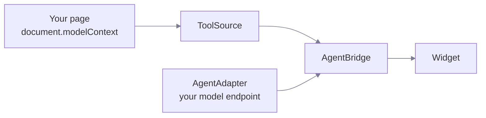

# Package

> One package, one entry point. `npm i action-wire`.

Everything ships in `action-wire`. It is ESM only and has one runtime
dependency, `ajv`, used to validate tool input against your schema.

```ts
import {
  createAssistant, // mount the widget
  createAgentBridge, // headless: no user interface
  createWebMCPSource, // read the tools on the page
  openAICompatible, // talk to your model endpoint
  AgentError, // every failure, with a code
} from 'action-wire';
```

Types come from the same place: `ToolSource`, `ToolDefinition`, `ToolCall`,
`ToolResult`, `ToolSnapshot`, `AssistantOptions`, `AssistantState`, `Assistant`,
`MountedAssistant`, `AgentAdapter`, `Message`, `Activity`, `Confirmation`,
`ConfirmationPolicy`, `ErrorCode`, and `Json`.

The package is marked `sideEffects: false`, so a bundler drops whatever you do
not import. Using only the headless bridge leaves the widget out of your build.

## How they fit



The bridge is the only place that runs a tool. The widget renders state and
sends user input. It holds no WebMCP logic and no model logic.

## Pick a layer

::card-group{cols="3"}
::card
---

title: Widget
icon: i-lucide-message-square
to: /reference/widget
---

`createAssistant`. You want a chat panel and you want it to look finished.
::

::card
---

title: Headless
icon: i-lucide-terminal
to: /reference/headless
---

`createAgentBridge`. You render the interface yourself.
::

::card
---

title: Tool source
icon: i-lucide-plug
to: /reference/tool-source
---

`ToolSource`. You supply the tools instead of the browser.
::
::

## Layers inside the package

The source keeps four layers, in `src/core`, `src/webmcp`, `src/agent`, and
`src/widget`. They import in one direction only, and a lint rule enforces it.
See [Architecture](/project/architecture).
