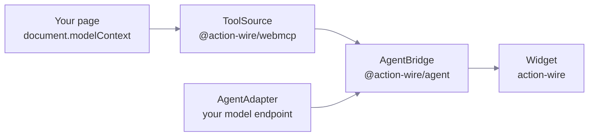

# Packages

> Four packages. Import the two you need, and the rest come with them.

| Package               | Install as        | What it holds                                       |
| --------------------- | ----------------- | --------------------------------------------------- |
| `action-wire`         | direct            | `createAssistant`. The Web Component widget.        |
| `@action-wire/agent`  | direct            | `createAgentBridge`, `openAICompatible`.            |
| `@action-wire/webmcp` | comes with widget | `createWebMCPSource`. Native discovery and execute. |
| `@action-wire/core`   | comes with widget | Types, registry, event emitter, `AgentError`.       |

All four are ESM only.

## How they fit



The bridge is the only place that runs a tool. The widget renders state and
sends user input. It holds no WebMCP logic and no model logic.

## Pick a layer

::card-group{cols="3"}
::card
---

title: Widget
icon: i-lucide-message-square
to: /reference/widget
---

`createAssistant`. You want a chat panel and you want it to look finished.
::

::card
---

title: Headless
icon: i-lucide-terminal
to: /reference/headless
---

`createAgentBridge`. You render the interface yourself.
::

::card
---

title: Tool source
icon: i-lucide-plug
to: /reference/tool-source
---

`ToolSource`. You supply the tools instead of the browser.
::
::

## Build order

The packages depend on each other in one direction: core, then webmcp and agent,
then the widget. Build them in that order when you work in this repository.

```sh
pnpm --filter ./packages/core --filter ./packages/webmcp \
     --filter ./packages/agent --filter ./packages/widget build
```
