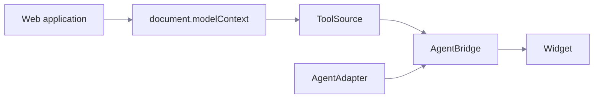

# Architecture

> The application owns the tools. The assistant discovers and uses them.

## Boundaries

| Part           | Responsibility                                       | What it must not do                 |
| -------------- | ---------------------------------------------------- | ----------------------------------- |
| `ToolSource`   | Discover and execute the tools on the page.          | Know about models or the interface. |
| `AgentAdapter` | Send messages and tool definitions to a model.       | Execute a tool.                     |
| `AgentBridge`  | Decide what runs, in what order, with what approval. | Render anything.                    |
| Widget         | Present state and collect input.                     | Hold WebMCP or model logic.         |

The bridge is the only execution gateway. Model output is an untrusted request
that passes through it, never around it.

## Why the layers split this way

Each boundary is an interface with a small surface, so any layer can be
replaced:

- Replace the source, and the assistant runs without native WebMCP. See
  [Without native WebMCP](/guide/without-webmcp).
- Replace the adapter, and it runs on a different model provider.
- Drop the widget, and the [headless bridge](/reference/headless) drives your own
  interface.

Only `@action-wire/webmcp` touches a browser API. Core, agent, and the widget are
plain TypeScript.

## Discovery scope

Discovery covers the current document. The source skips any tool whose `window`
is not the current window, so a frame cannot add tools to the parent's
assistant. Cross-origin frames are outside this release.

## Revisions

The registry revision covers normalized tool content. The native source also
raises its execution revision when registrations change, even when the public
name and schema stay the same.

A confirmation is bound to a call id, its arguments, the tool id, and the
revision. A later revision yields `STALE_TOOLS`, and the assistant does not
substitute another tool with the same name.

## Where credentials live

The model key lives on a Node.js route that the developer operates. The browser
posts to that route. The route forwards schemas and messages. It never executes
a browser tool.

## Out of scope

Voice, LiveKit, speech engines, WebRTC, accounts, RAG, and persisted history are
not in this release. Do not add those dependencies to the browser or core
packages.
