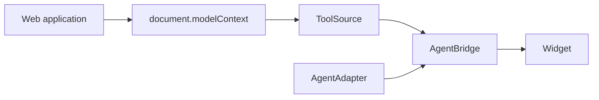

# Architecture

The application owns WebMCP tools. The assistant discovers and uses them. Do not duplicate application schemas inside the agent.

## Packages

| Package                | Role                                        |
| ---------------------- | ------------------------------------------- |
| `@webmcp-agent/core`   | Shared types, registry, events, errors      |
| `@webmcp-agent/webmcp` | Native discovery, schema normalize, execute |
| `@webmcp-agent/agent`  | `createAgentBridge`, `openAICompatible`     |
| `webmcp-agent`         | Web Component widget                        |

## Boundaries

- `ToolSource` discovers and executes page tools.
- `AgentAdapter` sends messages and tool definitions to a model.
- `AgentBridge` is the only execution gateway. Model output is an untrusted request.
- The widget presents state. It does not contain WebMCP or model logic.

Default discovery uses current-document tools. The source skips tools whose `window` is not the current window. Cross-origin frames are outside this release.

## Revisions

The registry revision covers normalized tool content. The native source also advances its execution revision when registrations change, even if names and schemas stay the same. A confirmation is bound to a call id, arguments, tool id, and revision. A later revision yields `STALE_TOOLS`. The assistant does not substitute another tool with the same name.

## Model endpoint

`openAICompatible({ endpoint })` posts JSON to a Node.js URL. The server forwards schemas. Browser tools run in the page. The server must not execute them.

## Out of scope

Voice, LiveKit, speech engines, WebRTC, accounts, RAG, and persisted history are not in this release. Do not add those dependencies to browser or core packages.
