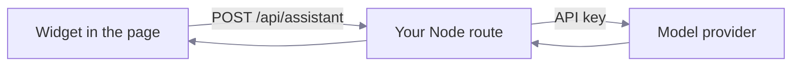

# Model endpoint

> The browser never holds your API key. A server route you own does.

`openAICompatible({ endpoint })` posts JSON to a URL on your own origin. That
route forwards the request to the model provider and adds the credentials.



::: caution
Never call a model provider straight from browser code. Anyone who opens
DevTools can read the key, and anyone who reads the key can spend your money.
:::

## What the browser sends

The adapter posts the transcript and the tool definitions it discovered on the
page:

```json [request body]
{
  "messages": [{ "role": "user", "content": "create a project called Phoenix" }],
  "tools": [
    {
      "type": "function",
      "function": {
        "name": "createProject",
        "description": "Create a project.",
        "parameters": { "type": "object", "properties": { "name": { "type": "string" } } }
      }
    }
  ]
}
```

The tool list changes with the page, so the server cannot hold a fixed copy. It
forwards what it receives.

## What the server must not do

The server does not run tools. It has no access to the page, the session, or the
user interface. It adds the key, forwards the request, and returns the response.
Tool handlers run in the browser, as the signed-in person, under the rules your
application already applies.

## The demo server

This repository ships a small Node server for development. It is not a product.

```sh
cp playground/.env.example playground/.env
node playground/server/index.ts
```

| Variable                   | Purpose                             |
| -------------------------- | ----------------------------------- |
| `ACTION_WIRE_UPSTREAM_URL` | The provider chat-completions URL.  |
| `ACTION_WIRE_MODEL`        | The model name to request.          |
| `ACTION_WIRE_API_KEY`      | The provider key. Server side only. |

It listens on `127.0.0.1:8787`. The Vite configurations proxy `/api/assistant`
to that address.

::: warning
The demo server has no authentication and no rate limit. A production route
needs both, plus a size limit on the request body and a check that the caller is
a signed-in user of your application.
:::

## Using a different provider

Any endpoint that accepts the OpenAI chat-completions shape works. To use a
provider with a different shape, write your own adapter instead. It is one
method:

```ts [adapter.ts]
import type { AgentAdapter } from 'action-wire';

export const myModel: AgentAdapter = {
  async generate({ messages, tools, signal }) {
    // Call your provider, then return the text and any tool calls.
    return { text: 'Done.', toolCalls: [] };
  },
};
```

<ReadMore to="/reference/model-adapter" title="AgentAdapter reference" />
